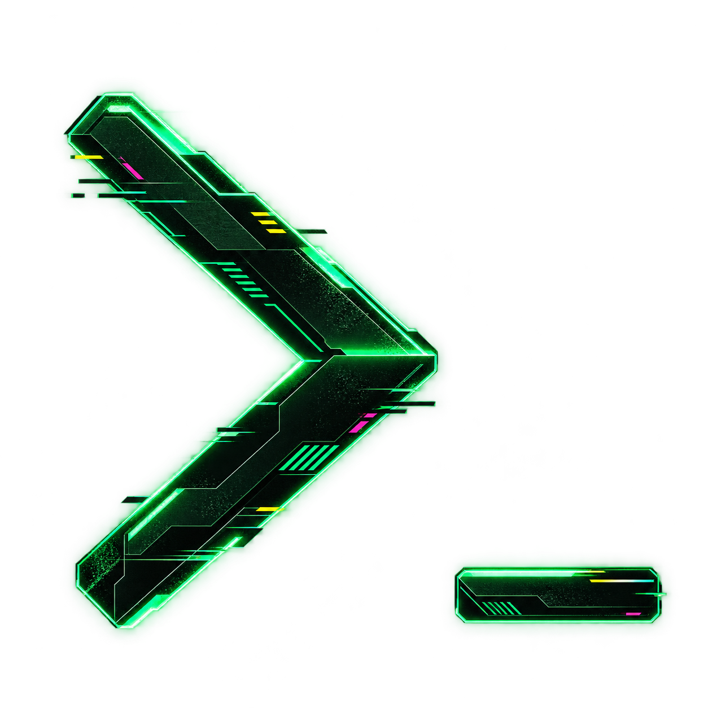

# Cyberdeck terminal mark

Fleet uses a green `>_` mark with dark etched surfaces, luminous angular edges and restrained signal cuts. Ghostty and Kitty display the full-resolution transparent PNG; unsupported terminals and plain output retain the Cyberdeck wordmark. The header remains four rows high, and narrow panes omit the image.

The cursor acknowledges an orchestrator entering **Working**, including a resumed process generation, with three blinks over 2.1 seconds. It then stays visible. Existing work at Fleet startup stays settled, worker starts do not trigger the mark, and overlapping starts do not extend an active pulse. The signal texture is static.

The PNG is uploaded once per Fleet screen entry. Cursor coverage changes reuse the same image, so the chevron stays still. Inside tmux, graphics passthrough is scoped to Fleet's pane for each graphics transfer and its prior setting is restored immediately afterward, before any provider attachment. No terminal capability query sends replies into provider input.

The approved image was produced with built-in imagegen from the [original prompt reference](terminal-prompt-reference.png). The [exact edit prompt](../../src/client/assets/cyberpunk-prompt.prompt.txt) is retained beside the runtime asset. `pnpm build` copies the approved PNG into `dist/src/client/assets` for publication.
